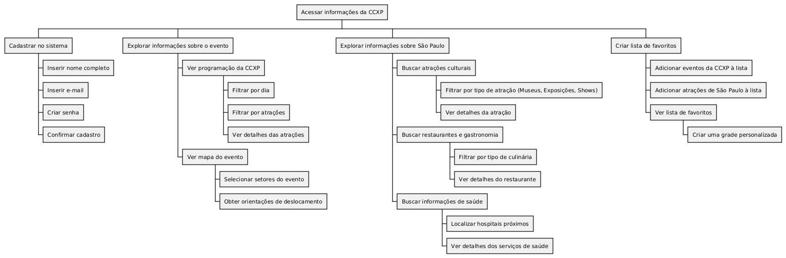

# Análise Hierárquica de Tarefas (AHT)

Um Diagrama de Análise Hierárquica de Tarefas (AHT) é uma ferramenta usada para decompor uma tarefa complexa em subtarefas mais simples e organizadas de forma hierárquica. Ele ajuda a entender a estrutura de uma tarefa, identificando seus componentes e a relação entre eles. Esse diagrama é muito utilizado no design de interfaces e sistemas interativos, onde é importante mapear as ações que o usuário executará para atingir um objetivo.

Aqui estão os principais elementos de um diagrama de AHT:

1. Tarefa Principal: É a tarefa geral que se deseja decompor. Geralmente, está no topo do diagrama.

2. Subtarefas: São divisões da tarefa principal, que podem ser divididas em ações menores. Cada subtarefa representa uma ação necessária para completar a tarefa.

3. Relação Hierárquica: As subtarefas são conectadas à tarefa principal por linhas, mostrando a relação de dependência ou sequência de execução.

4. Operações: São as ações específicas ou decisões que o usuário deve tomar durante a execução das subtarefas.

## AHT: CCXP Guide

[]
 